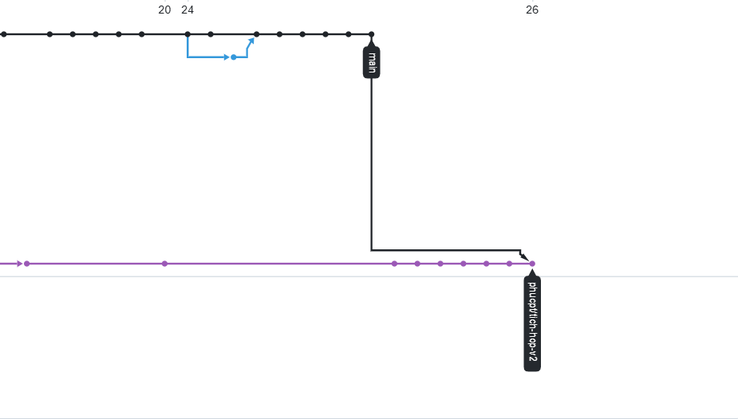
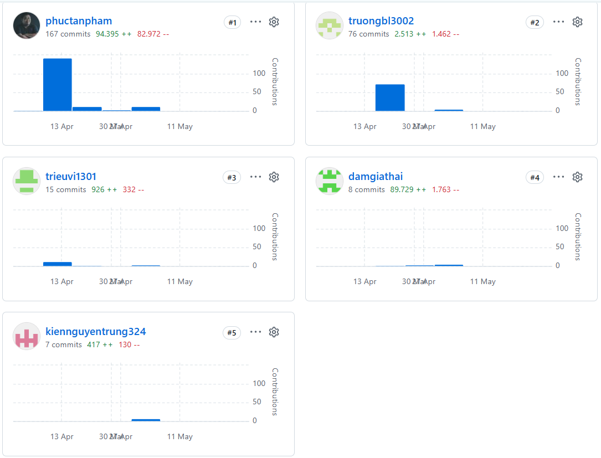

## Brief
 - Lập trình trò chơi xếp hình bằng C++
 - Link trò chơi: https://phuctanpham.github.io/ctetris/
## Contributors:
 * Ngô Triều Vĩ – MSSV: 25730160
 * Phạm Tấn Phúc – MSSV: 25730134
 * Tạ Minh Trường – MSSV: 25730157
 * Đàm Gia Thái – MSSV: 25730144
 * Nguyễn Trung Kiên – MSSV: 25730118
## Mentor:
 * ThS. Nguyễn Văn Toàn
## Milestones and Expected Deliveries:
* Trước Tuần 1: Thử nghiệm và Nghiên cứu SFML / SDL3 và EMSDK để tập làm quen với các thư viện âm thanh và đồ họa trên đa nền tảng (Desktop và Web Application)
* Tuần 2: Làm lại từ đầu theo hướng dẫn gợi ý để viết ứng dụng trên 1 file main.cpp duy nhất.
* Tuần 3: Chuyển qua hướng đối tượng theo hướng dẫn gợi ý
* Tuần 4: Kế thừa các thí nghiệm và nghiên cứa với SFML / SDL3 và EMSDK kết hợp với SQLLite / API để nâng cao chất lượng mã nguồn với âm thanh, hình ảnh và CSDL 
* Tóm tắt:
    * Trước tuần 1, từ 07/04 - 05/05 ~ 4 tuần
    * Sau tuần 1, từ 05/05 - 26/05 ~ 3 tuần
## Explaination
1) Đồ thị github network trước khi merge V2 vào Main. 
  
2) Thống kê github commit trước khi merge V2 vào Main. 
  
